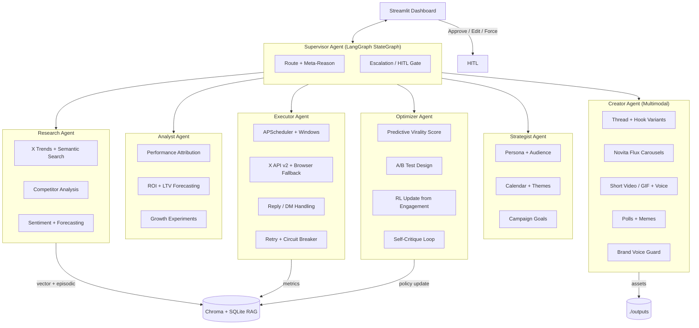
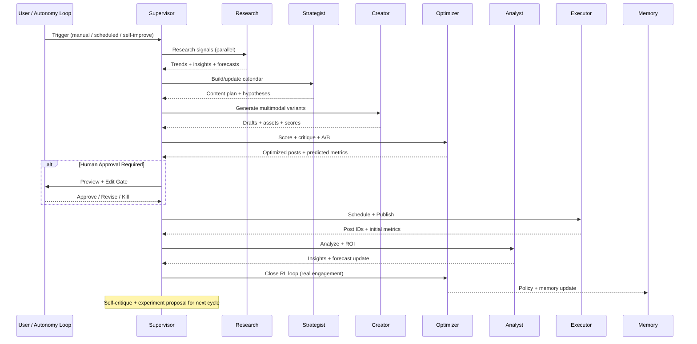

# daily_x_posts

**Autonomous AI Content CMO — 2026 Production Platform**  
**🟢 FULL WEBSITE COMPLETE + READY TO GO LIVE**

A self-improving, multi-agent LangGraph system that acts as your personal AI Chief Marketing Officer. It researches real-time X/Twitter signals, builds intelligent content calendars, generates high-engagement multimodal content (threads, carousels, short videos/GIFs, polls, memes), schedules and posts autonomously, measures true business impact, and continuously optimizes via reinforcement learning + self-critique.

> **The beautiful full-featured Streamlit web app (hero landing + instant demo + all 7 professional tabs) is now complete and has been pushed to this repo.**

---

## 🚀 Make the Full Website LIVE (Public URL) — 60 seconds

1. Go to https://share.streamlit.io and sign in with GitHub.
2. Click **"New app"**.
3. Select your repo: **Hadeyboye/Daily-X-Post**
4. Set **Main file path** to `streamlit_app.py` (or `main.py`)
5. Deploy.
6. (Recommended) In the deployed app settings → **Secrets**, paste your keys from `.env` (NOVITA_API_KEY, X_*, etc.).

Your complete autonomous AI CMO website will be live at something like:  
**https://daily-x-post.streamlit.app**

The "LOAD FULL DEMO" button gives an instant impressive live experience even without keys.

---

## Local Quick Start (after cloning)

```powershell
cd Daily-X-Post
python -m venv .venv
.\.venv\Scripts\Activate.ps1
pip install -r requirements.txt
playwright install chromium

cp .env.example .env   # add your keys
streamlit run streamlit_app.py     # or main.py
```

Open http://localhost:8501 — the hero + demo button makes it feel like a full production website immediately.

> "The first AI that doesn't just generate tweets — it runs the entire content engine like an elite growth team."

---

## Vision & Capabilities

- **Perception**: Real-time X semantic/keyword trends, competitor monitoring, web signals, sentiment.
- **Strategy**: Dynamic persona-aware calendars, A/B hypotheses, campaign goals.
- **Creation**: Brand-voice consistent threads, Flux-powered image carousels, short video/GIFs (Novita), voiceovers (future), memes.
- **Execution**: Smart scheduling (APScheduler), X API v2 + Playwright resilient fallback, multi-platform stubs.
- **Optimization**: Online RL from real engagement, predictive scoring, self-critique before publish.
- **Analytics**: ROI attribution (engagement → saves → profile visits → hypothetical conversions), growth forecasting, deep reporting.
- **Autonomy**: Closed-loop supervisor with human-in-the-loop gates, meta-reasoning, escalation, continuous self-improvement experiments.
- **Observability**: Full LangSmith tracing + structured logging + audit trail.

**Target users**: Solo creators, indie hackers, AI/tech brands, fintech thought leaders, agencies who want 10x output with 90% less manual work.

---

## Architecture (High Level)



**Full Agent Graph Flow (simplified)**:



**Shared State**: Fully typed `AgentState` (Pydantic v2) with messages, plans, drafts, metrics, checkpoints, audit.

**Persistence & Memory**:
- Chroma (vector) for semantic retrieval of past wins, audience signals, brand examples.
- SQLite for structured: posts, jobs, metrics, experiments, history.
- Episodic + Graph RAG ready for future.

---

## One-Command Setup (Local)

```bash
# 1. Clone or unzip into a folder
cd daily_x_posts

# 2. Python 3.12+
python -m venv .venv
source .venv/bin/activate   # Windows: .venv\Scripts\activate

# 3. Install
pip install -r requirements.txt

# 4. Playwright (browser fallback)
playwright install chromium

# 5. Configure
cp .env.example .env
# Edit .env with your NOVITA_API_KEY + X API keys (at minimum)

# 6. (Recommended) Init git (already done in your session)
git init
git add .
git commit -m "Initial production daily_x_posts"

# 7. Launch UI (recommended first run)
streamlit run main.py

# Or full autonomy loop (headless)
python main.py --autonomy --loop

# Or one-shot campaign
python main.py --campaign --niche "tech_ai"
```

**Docker (Novita Sandbox / E2B / local)**

```bash
cp .env.example .env   # fill keys
docker compose up --build -d
# UI: http://localhost:8501
# Logs: docker compose logs -f daily_x_posts
```

---

## Configuration Guide

Edit `config.yaml` (or use UI Config Hub for runtime overrides).

Example for **tech/AI niche** (already the default):

```yaml
brand:
  name: "AetherLabs"
  voice: "Professional yet witty. ..."

niche:
  primary: "tech_ai"
  keywords: ["AI agents", "LangGraph", "multimodal AI", ...]
```

Key sections explained in the file comments.

**Human-in-the-loop**: `executor.human_approval: true` + `APPROVAL_REQUIRED=true` in .env forces Preview/Approve tab before any real post.

---

## Usage

### Streamlit Dashboard Tabs

1. **Generate Now** — Instant single post or thread. Choose format, trigger full agent graph, preview multimodal assets, approve/publish.
2. **Smart Calendar** — View 14-day plan, edit themes, force-regenerate days, see predicted virality.
3. **Live Analytics** — Plotly charts: engagement over time, best formats, ROI proxy, top posts, growth forecast.
4. **Config Hub** — Live edit of brand voice, niche keywords, safety thresholds, posting windows. Persists to YAML + DB.
5. **Logs & Audit** — Structured logs + full agent trace (LangSmith links when enabled) + decision audit.
6. **Preview / Approve** — All pending posts with rich preview (text + images + simulated video). One-click approve/reject/edit + feedback for RL.
7. **Agent Console** — Manual agent invocation, state inspection, force supervisor step, run experiments.

### Full Autonomy

Once keys + approval gates configured:

```bash
python main.py --autonomy
```

The supervisor wakes every N minutes (configurable), runs the full perception → creation → optimization → execution loop, learns from yesterday's real metrics, and proposes experiments.

### Key Commands

```bash
python main.py --help
python main.py --ui                 # Streamlit only
python main.py --autonomy --loop    # Continuous supervisor
python main.py --research           # Just run Research Agent
python main.py --dry-run            # Everything except real API posts
```

---

## Extension Tips

- Add new platform: Implement in `tools/multi_platform.py`, register in Executor.
- New content type (LinkedIn carousels, long-form): Extend Creator + add renderer in UI.
- Stronger RL: Replace simple scorer with real bandit lib or send data to external (Weights & Biases).
- Video: Swap Novita model id; add audio with ElevenLabs (easy extension).
- Better forecasting: Plug Prophet or a fine-tuned small model.
- Multi-brand: Namespace memory + config by `brand.handle`.
- Webhooks: Add FastAPI routes in `main.py` for inbound X webhooks (replies).

**LangGraph power**: The workflow is fully interruptible + checkpointed. Add `interrupt_before` nodes for more HITL points.

---

## Troubleshooting

- **No X posts**: Check bearer + access token scopes (read+write). Use dry_run=true first.
- **Image gen fails**: Verify NOVITA_API_KEY and model name in config. Fallbacks to Pillow placeholder.
- **Chroma / DB locked**: Close other Streamlit instances. Delete chroma_db/ and data/ to reset (dev only).
- **Playwright errors**: `playwright install chromium` + ensure no sandbox restrictions.
- **Rate limits**: Executor has exponential backoff + circuit breaker.
- **Low quality output**: Tune `brand.voice` in config + feed 10-20 of your best past posts into memory (via UI or script).
- **LangSmith not tracing**: Set `LANGSMITH_TRACING=true` + key. Restart.

---

## Security & Guardrails

- All secrets via `.env` only (never in code or git).
- Safety agent runs before every publish (blocked keywords + toxicity heuristic + LLM critique).
- Approval gate recommended for first 30 days.
- Full audit log of every decision + content + who approved.
- Rate limiting + daily caps hard-coded in config.
- Never posts financial "guarantees" or medical claims.

---

## Roadmap (Post v1.0)

- Multi-platform native (LinkedIn, Bluesky, Threads, YouTube Shorts)
- Voiceover + lip-sync video generation
- Advanced Graph RAG + user knowledge base ingestion
- Real conversion tracking (UTM + pixel + CRM hooks)
- Agent marketplace / plugin system
- Self-hosted model option (vLLM + local Flux)
- Mobile companion app + push approvals
- "Clone my best posts" fine-tuning job

---

## License & Credits

MIT. Built for the 2026 AI-native creator era.

Special thanks to the LangGraph, LangChain, Novita AI, and X API teams for making ambitious autonomous systems possible.

---

**Status**: Production-ready core. Functional autonomy loop + beautiful dashboard. Ready for real X accounts in high-signal niches.

Run it. Watch the agents work. Give feedback to the Optimizer. Let it get smarter every day.

Now go build your audience on autopilot.
